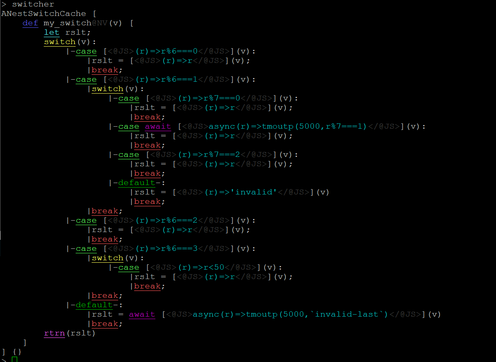

nv-facutil-switch
==================
- nv-facutil-switch  is a simple-util to avoid using-of-switch-case
- support async matcher AND async handler
- if match, the default-action-after-handle is break, NOT continue

- switch-case normally can only be changed in COMPILE-TIME, it's NOT convinient
- switch-case is HARD(maybe impossible) to auto-dynamic-handle in RUNTIME

install
=======
- npm install nv-facutil-switch 

usage
=====

     const {
         cmmn,
         creat_sync_simple_switch,
         creat_async_simple_switch,
         creat_sync_simple_switch_cache,
         creat_async_simple_switch_cache,
         creat_sync_nest_switch,
         creat_async_nest_switch,
         creat_sync_nest_switch_cache,
         creat_async_nest_switch_cache,
     } = require("nv-facutil-switch");

    
example
-------
    

### nest

- creat\_SYNC\_nest\_switch   support-only-SYNC-matcher-and-handler,          but performance better
- creat\_ASYNC\_nest\_switch  support-both-SYNC-AND-ASYNC-matcher-and-handler

        //completion                   break-OR-continue
             ----default is break , NOT continue!!!!

        //CASE                         [matcher, handler,completion]

        //DEFAULT                      {matcher, handler}
            //----if DEFAULT     exist ,completion always be BREAK
        
        //EMPTY
        
        //SWITCHER
        [
           <CASE     | SWITCHER>,
           .....
           <CASE     | SWITCHER>,
           <DEFAULT  |   EMPTY>
        ]

        const tmoutp = require('timers/promises').setTimeout;

        var dflt_handler = (r)=>'invalid'

        var entries = [//switch@root
            [(r)=>r%6===0, (r)=>r,  /*default:cmmn.break*/],
            [
                (r)=>r%6===1,
                [ //switch1@child
                    [(r)=>r%7===0,                            (r)=>r,             /*default:cmmn.break*/],
                    [async(r)=>tmoutp(5000,r%7===1),          (r)=>r,             /*default:cmmn.break*/],
                    [(r)=>r%7===2,                            (r)=>r,             /*default:cmmn.break*/],
                    {handler:(r)=>'invalid' ,completion:cmmn.break/*default:cmmn.break*/}                        //default CASE of switch1@child
                ],
                cmmn.break                                         // this could be omitted,/*default:cmmn.break*/
            ],
            [(r)=>r%6===2, (r)=>r,  /*default:cmmn.break*/],
            [
                (r)=>r%6===3,
                [//switch2@child
                    [(r)=>r<50,          (r)=>r,             /*default:cmmn.break*/]
                    //switch2@child without default CASE
                ],
                cmmn.break                            // this could be omitted,/*default:cmmn.break*/
            ],
            {handler:async(r)=>tmoutp(5000,`invalid-last`), completion: cmmn.break /*default:cmmn.break*/}                      //default CASE of switch@root
        ]

        var ANestSwitch = creat_async_nest_switch(entries,dflt_handler)
        var switcher = new ANestSwitch()

;     

        await switcher.handle(6)
        await switcher.handle(7)
        await switcher.handle(31)
        await switcher.handle(8)
        await switcher.handle(63)
        await switcher.handle(33)
        await switcher.handle(34)

        /*
        > await switcher.handle(6)
        6
        > await switcher.handle(7)
        7
        > await switcher.handle(31)
        'invalid'
        > await switcher.handle(8)
        8
        > await switcher.handle(63)
        undefined
        > await switcher.handle(33)
        33
        > await switcher.handle(34)
        'invalid-last'
        >

        */

### nest-cache

### simple 
- creat\_SYNC\_simple\_switch   support-only-SYNC-matcher-and-handler,          but performance better
- creat\_ASYNC\_simple\_switch  support-both-SYNC-AND-ASYNC-matcher-and-handler

        const tmoutp = require('timers/promises').setTimeout;

        //ENTRY   [match-function, handle-function, completion]
        //        ----completion COULD-BE break-OR-continue ,
        //        ----default is break , NOT continue!!!!

        var entries = [
            [(r)=>r===0,                         (r)=>0,                      /*default:cmmn.break*/],
            [(r)=>r===1,                         async(r)=>tmoutp(5000,100),  /*default:cmmn.break*/],
            [ async(r)=>tmoutp(5000,r===2),      (r)=>200,                    /*default:cmmn.break*/],
        ]

        var dflt_handler = (r)=>'invalid'

        var SimpleSwitch = creat_async_simple_switch(entries,dflt_handler)
        var switcher = new SimpleSwitch()

        await switcher.handle(0)
        //0
        await switcher.handle(1)
        //100
        await switcher.handle(2)
        //200
        await switcher.handle(3)
        //'invalid'
        await switcher.handle(4)
        //'invalid'
        

        > await switcher.handle_rtrn_$breaker_handler_index_matcher$(1)
                {
                  index: 1,
                  matcher: [Function (anonymous)],
                  handler: [AsyncFunction (anonymous)],
                  breaker: true
                }

        >

### simple-cache

        var entries = [
            [(r)=>r%3===0,                         (r)=>0,                      /*default:cmmn.break*/ ],
            [(r)=>r%3===1,                         async(r)=>tmoutp(5000,100),  /*default:cmmn.break*/ ],
            [ async(r)=>tmoutp(5000,r%3===2),      (r)=>200,                    /*default:cmmn.break*/ ],
        ]

        var dflt_handler = (r)=>'invalid'
        
        
        var SimpleSwitchCache = creat_async_simple_switch_cache(entries,dflt_handler)
        var switcher = new SimpleSwitchCache()
        
        await switcher.handle(5)
        await switcher.handle(13)
        await switcher.handle(6)
        await switcher.handle(7)
        await switcher.handle(87)
        
        var matcher1 = entries[1][0]
        matcher1
        
        > switcher.group(matcher1) 
        [ 13, 7 ]
        >

        > switcher.group_cache_
        [ [ 6, 87 ], [ 13, 7 ], [ 5 ] ]
        >
        
        > switcher.reset_group_cache()
        > switcher.group_cache_
        [ [], [], [] ]
        >

METHODS
=======

### nest

    switcher._handle               switcher.dflt_handler_
    switcher.gen                   switcher.handle                switcher.src_
    switcher.tree_

### nest-cache

        switcher._handle               switcher.constructor           switcher.dflt_cases_
        switcher.dflt_handler_         switcher.gen                   switcher.group_cache_
        switcher.handle                switcher.handlers_             switcher.matchers_
        switcher.reset_group_cache     switcher.src_                  switcher.tree_

### simple

        switcher._handle                                      switcher.breaker
        switcher.breakers_                                    switcher.constructor
        switcher.dflt_handler_                                switcher.handle
        switcher.handle_rtrn_$breaker$                        switcher.handle_rtrn_$breaker_handler$
        switcher.handle_rtrn_$breaker_handler_index$          switcher.handle_rtrn_$breaker_handler_index_matcher$
        switcher.handle_rtrn_$breaker_handler_matcher$        switcher.handle_rtrn_$breaker_index$
        switcher.handle_rtrn_$breaker_index_matcher$          switcher.handle_rtrn_$breaker_matcher$
        switcher.handle_rtrn_$handler$                        switcher.handle_rtrn_$handler_index$
        switcher.handle_rtrn_$handler_index_matcher$          switcher.handle_rtrn_$handler_matcher$
        switcher.handle_rtrn_$index$                          switcher.handle_rtrn_$index_matcher$
        switcher.handle_rtrn_$matcher$                        switcher.handler
        switcher.handlers_                                    switcher.idxes
        switcher.matcher                                      switcher.matchers_
        switcher.src_

### simple-cache

        switcher._handle                                      switcher.breaker
        switcher.breakers_                                    switcher.constructor
        switcher.dflt_handler_                                switcher.group
        switcher.group_cache_                                 switcher.handle
        switcher.handle_rtrn_$breaker$                        switcher.handle_rtrn_$breaker_handler$
        switcher.handle_rtrn_$breaker_handler_index$          switcher.handle_rtrn_$breaker_handler_index_matcher$
        switcher.handle_rtrn_$breaker_handler_matcher$        switcher.handle_rtrn_$breaker_index$
        switcher.handle_rtrn_$breaker_index_matcher$          switcher.handle_rtrn_$breaker_matcher$
        switcher.handle_rtrn_$handler$                        switcher.handle_rtrn_$handler_index$
        switcher.handle_rtrn_$handler_index_matcher$          switcher.handle_rtrn_$handler_matcher$
        switcher.handle_rtrn_$index$                          switcher.handle_rtrn_$index_matcher$
        switcher.handle_rtrn_$matcher$                        switcher.handler
        switcher.handlers_                                    switcher.idxes
        switcher.matcher                                      switcher.matchers_
        switcher.reset_group_cache                            switcher.src_

LICENSE
=======
- ISC 
